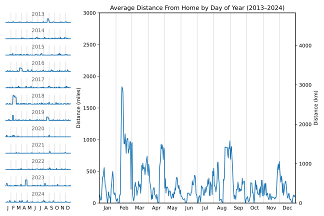
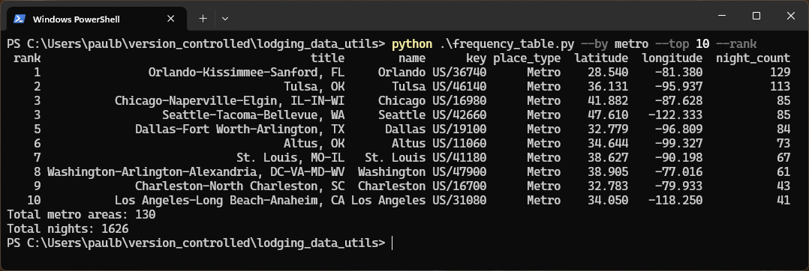
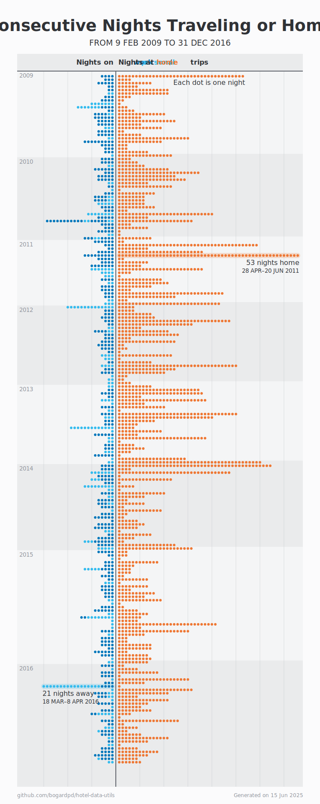

# Lodging Data Utilities

This package contains utilities for working with a traveler’s personal lodging log. In addition to hotel stays, this log can also document stays at short-term-rentals, stays with friends and family, and even overnight flights.

## Data Structure

These scripts use a GeoPackage (.gpkg) file as their primary data source. The structure of this file is documented in [Data Structure](docs/data_structure.md).

## Definitions: Nights, Mornings, and Evenings

Lodging stays are measured (and billed) by nights rather than days. A one-night stay generally involves two separate calendar days (check in on one day and check out the next). Likewise, longer stays involve one more day than nights; for example, a four-night stay involves five calendar days.


Each night at a hotel (or other lodging) spans two calendar days. For any given stay, the dates of morning[*n*] and evening[*n+1*] are the same. The check in date is always equal to evening[0], and the check out date is always equal to the last morning.

When scripts in this project need to assign a single specific date to each night, the morning date is used.

> [!NOTE]
> For some lodging stays, the check-in may occur after midnight (or the check out may occur before midnight). In these instances, a lodging night will only actually involve one single calendar day. However, since the reservation would still cover both calendar days, the night’s evening will still be recorded as the day prior to the night’s morning.

## Scripts

### Annual Night Counts

Generates a CSV file with the following columns:

| Column | Description |
|--------|-------------|
| year | Every year from the first morning of the earliest stay to the present |
| business_night_count | Number of nights away from home for business travel |
| personal_night_count | Number of nights away from home for personal travel |

The CSV will include all years from the first year with data through the present year. Years with no business nights or no personal nights will show `0` in the appropriate night count column.

#### Script

`annual_night_counts.py`

#### Arguments

- `output_csv` (required): Path to the output CSV file.

#### Usage Example

```sh
python annual_night_counts.py output/annual_night_counts.csv
```

### Distance from Home by Day

Generates a Matplotlib chart showing every morning of the year (from 1 Jan to 31 Dec) on the X axis, and distance from home for each morning on the Y axis.


This script can also be used to show multiple years at once, as well as an average distance from home for each calendar day.



In single year mode, the script can produce a CSV output of distance data with the following columns:

| Column | Description |
|--------|-------------|
| morning | Morning date (YYYY-MM-DD) |
| distance_mi | Distance from home in miles (floating point) |

#### Script

`distance_from_home_by_day.py`

#### Subcommands
- `single`: Plot for a single year.
- `multi`: Plot for a range of years and/or average.

#### Arguments for `single`

- `--year YYYY` (required): Year to plot.
- `--labels FILE` (optional): A CSV file with `morning` (YYYY-MM-DD) and `label` columns, specifying morning dates to label.
- `--earliest_prior_year YYYY` (optional): Show prior years starting from this year for comparison.

> [!IMPORTANT]
> If `year` is not a leap year, the chart will not show data for 29 February on any prior leap year.

- `--output_img FILE` (optional): Output image file path (SVG or PNG).
- `--output_csv FILE` (optional): Output CSV file path for distance data.

#### Arguments for `multi`

- `--start_year YYYY` (required): First year to include.
- `--thru_year YYYY` (required): Last year to include.
- `--output_img FILE` (optional): Output image file path(s) (SVG or PNG).

#### Usage Examples

- Single year:
    ```sh
    python distance_from_home_by_day.py single --year 2023 --output_img output/distance_2023.svg --output_csv output/distance_2023.csv
    ```

- Single year with prior years for comparison:
    ```sh
    python distance_from_home_by_day.py single --year 2023 --earliest_prior_year 2019 --output_img output/distance_2023_with_prior.png
    ```

- Range of years with average:
    ```sh
    python distance_from_home_by_day.py multi --start_year 2013 --thru_year 2024 --output_img output/distance_multi.svg
    ```

### Frequency Table

Generates a Pandas DataFrame of places, which groups all stays by a specified place level (stay location, city, region, or metro) and provides the total nights spent at each.



If a stay does not have the specified place type, the next broadest place type that is available will be used. (Metros and regions are broader than cities, which are broader than stay locations.) For example, if the grouping is by metro but a stay is in a city that’s not in a metro area, the city will be used instead for that stay.

The DataFrame has the following structure:

| Column | Description |
|--------|-------------|
| rank | The rank of this place. Only present when `--rank` is specified. |
| title  | Formal name of the place. Only present if any metro areas are in the DataFrame. |
| name | Short name for use in map labels |
| key | fid (stay locations), key (cities, metros), or ISO 3166-2 (regions)
| place_type | **StayLocation**, **City**, **Metro**, or **Region**. Typically the grouping type specified by the `--by` argument. If any entry does not have the specified place type, then this column shows the place type actually used.
| latitude | Latitude in decimal degrees |
| longitude | Longitude in decimal degrees |
| night_count | Number of nights spent at this place |

This can be exported to CSV for use in GIS software.

#### Script

`frequency_table.py`

#### Arguments
- `--by {location,city,region,metro}` (required): Grouping type.
- `--start_morning YYYY-MM-DD` (optional): The earliest morning to include. If omitted, will use the earliest morning in the log data.
- `--thru_morning YYYY-MM-DD` (optional): The latest morning to include. If omitted, will use today’s date.
- `--exclude_transit` (optional): Exclude nights spent in transit (flights).
- `--output_csv FILE` (optional): Output CSV file path.
- `--top N` (optional): Show only the top N results.
- `--rank` (optional): Add a ranking column.
- `--silent` (optional): Do not show output table in the console.

#### Usage Examples

- Group by city and print to console:
    ```sh
    python frequency_table.py --by city
    ```

- Group by region, exclude flights, and save to CSV:
    ```sh
    python frequency_table.py --by region --exclude_transit --output output/frequency_by_region.csv
    ```

- Show top 10 locations, ranked:
    ```sh
    python frequency_table.py --by location --top 10 --rank
    ```

### Nights Away and Home

Generates an SVG image for a plot of nights spent traveling (divided into work and personal nights) and nights spent at home.



#### Script

`nights_away_and_home.py`

#### Arguments

- `--output_svg FILE` (required): Output SVG image file path.
- `--output_stats FILE` (optional): Output text file for summary stats.
- `--start_evening YYYY-MM-DD` (optional): The first evening to include in the chart. If omitted, will use the earliest evening in the log data.
- `--thru_morning YYYY-MM-DD` (optional): The last morning to include in the chart. If omitted, will use today’s date.

#### Usage Examples

- Include a stats output file:
```sh
python nights_away_and_home.py --output_svg output/nights_away_and_home.svg --output_stats output/nights_stats.txt
```

- Filter by a date range:
```sh
python nights_away_and_home.py --output_svg output/nights_2022.svg --start_evening 2022-01-01 --thru_morning 2022-12-31
```

### Regions Lived/Stayed Report

Generates a CSV file of regions with True/False values for `lived_in` and `stayed_in` for each. Stays in transit are excluded. For admin level 0 regions (countries) which have admin level 1 subdivisions (states, provinces, etc.) in the `regions` table, each country’s `lived_in` and `stayed_in` values will be True if any of its subdivisions were lived in or stayed in, respectively.

#### Sample CSV Output

| iso_3166 | name          | admin_level | lived_in | stayed_in |
|----------|---------------|-------------|----------|-----------|
| …        | …             | …           | …        | …         |
| SE       | Sweden        | 0           | False    | True      |
| US       | United States | 0           | True     | True      |
| US-AK    | Alaska        | 1           | False    | True      |
| US-AL    | Alabama       | 1           | False    | True      |
| US-AR    | Arkansas      | 1           | False    | True      |
| US-AZ    | Arizona       | 1           | False    | True      |
| US-CA    | California    | 1           | False    | True      |
| US-CO    | Colorado      | 1           | True     | True      |
| …        | …             | …           | …        | …         |

#### Script

`regions_lived_stayed_report.py`

#### Arguments

- `output_csv` (required): Path to the output CSV file.

#### Usage Example

```sh
python regions_lived_stay_report.py output/report.csv
```
