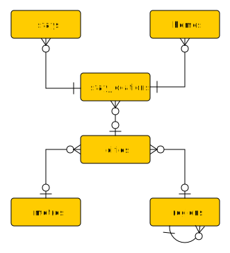

# Lodging Data Structure

These scripts use a [GeoPackage file](https://www.geopackage.org/) containing lodging location data for a single traveler. The location of this file is defined in [config/data_sources.toml](/config/data_sources.toml), with the key `lodging_gpkg`.

## Template

An empty [Lodging.gpkg file](/templates/Lodging.gpkg) is located in the [templates](/templates/) folder.

## GeoPackage Layers

GeoPackage files are SQLite databases, so each layer is a table.

> [!NOTE]
> Columns use the data types specified in the GeoPackage Encoding Standards [Table 1. GeoPackage Data Types](https://www.geopackage.org/spec/#table_column_data_types), and geometry types specified in [Annex G: Geometry Types (Normative)](https://www.geopackage.org/spec/#geometry_types). Optional fields must be null when unused.

The layer tables have the following relationships:

### stays (No Geometry)

The `stays` table contains records of each of the traveler’s stays at a hotel (or other lodging locations).

| Column | Data Types | Description |
|--------|--------|-------------|
| `fid` | INT (64 bit) | Primary key for the stay record. |
| `check_in_date` | DATE | Date of arrival to the stay (in the lodging location’s time zone), in **YYYY-MM-DD** format. If arrival occurs after midnight but the stay is booked/billed starting prior to midnight, then the date prior to midnight should be used as the check in date. |
| `nights` | MEDIUMINT (32 bit) | Number of nights spent on the stay. Should be equal to the difference in days between the check-in date and the check-out date. |
| `portfolio` | TEXT | Optional. The collection of hotel brands or short-term rentals, usually with its own loyalty program (e.g. `Hilton` or `VRBO`), that this lodging belongs to. Leave null if this stay does not have a portfolio. |
| `brand` | TEXT | Optional. Hotel brand (e.g. **Hampton Inn**). Short-term rentals will generally leave this null. Hotels which are not part of a chain, residences, and overnight flights should leave this null. |
| `stay_location_fid` | INT (64 bit) | Foreign key referencing the `stay_locations` table. |
| `purpose` | TEXT | `Business` or `Personal`. |
| `room` | TEXT | Optional. Room number(s) for the stay, if available. Separate multiple room numbers with commas. |
| `absence_flags` | TEXT | Optional. A string of `P` and `A` characters indicating presence or absence at the stay’s location for that night of the stay. For example, `PPAP` on a four night stay indicates that the traveler was present for the first two nights, absent for the third, and present for the fourth. If not null, the string length must be equal to the value of the `nights` column. If null, then it is assumed that all nights were spent at the stay’s location. |
| `comments` | TEXT | Optional. Comment or note about the stay. |

> [!NOTE]
> The data for each stay should be accurate for the time the stay occurred. For example, if a hotel has since changed portfolios, the stay record should still reflect that hotel’s portfolio _at the time of the stay_.

A traveler may not be present at more than one stay for any given night. If two or more stays have overlapping nights, absence flags must be set appropriately to indicate where the traveler actually spent the night. If a traveler is absent from all stays on any given night, it is assumed the traveler was at home that night.

### homes (No Geometry)

The `homes` table contains places the traveler has lived, for use in generating [Distance from Home by Day](/#distance-from-home-by-day) charts.

| Column | Data Types | Description |
|--------|--------|-------------|
| `fid` | INT (64 bit) | Primary key for the home record. |
| `move_in_date` | DATE | Date that the traveler moved into this home (in the lodging location’s time zone), in **YYYY-MM-DD** format. The mornings associated with this home will start the following morning, and go through the next chronological move_in_date (or through the present day, if this is the most recent move_in_date). |
| `stay_location_fid` | INT (64 bit) | Foreign key referencing the `stay_locations` table. |
| `comments` | TEXT | Optional. Comment or note about the home. |

### stay_locations (Point)

The `stay_locations` table contains point features representing distinct locations where the traveler has had `stays` (including overnight flights), and `homes` the traveler has lived at. This usually means that each record is a specific property, but different lodging instances could occupy the same property at different times as described in [Lodging Database Criteria for New vs. Updated Records](lodging_new_vs_updated_records.md).

| Column | Format | Description |
|--------|--------|-------------|
| `fid` | INT (64 bit) | Primary key for the lodging location. |
| `geom` | POINT | Geographic coordinates (latitude/longitude) of the location. |
| `name` | TEXT | The name of the lodging. If the lodging is a chain hotel and the chain is part of the name, include the chain in the name (e.g. **Embassy Suites by Hilton Chicago Downtown Magnificent Mile**). Residences should be named after the person(s) occupying the residence. |
| `type` | TEXT | `Hotel`, `STR` (Short Term Rental, such as Airbnb or VRBO), `Campsite`, `Residence` (someone’s home), `Flight` (as described in [Overnight Flights](#overnight-flights)), or `Other`. |
| `city_fid` | INT (64 bit) | Optional. Foreign key referencing the `cities` table. Flight midpoints may be left null, but flight endpoints should reference the airport itself as a city (as described in [Overnight Flights](#overnight-flights)). |
| `address` | TEXT | Optional. Full address of the location. |
| `is_approximate` | BOOLEAN | `1` if coordinates are approximate; otherwise `0`. |
| `brand` | TEXT | Optional. Hotel brand, if applicable. |
| `portfolio` | TEXT | Optional. Loyalty program or hotel portfolio. |
| `portfolio_code` | TEXT | Optional. Internal portfolio-specific identifier (e.g. loyalty code). |
| `comments` | TEXT | Optional. Comment or note about the lodging location. |

> [!NOTE]
> The data for each stay location should be accurate for the present time (or the most recent time the stay location was operational, if it is no longer operational). For example, if a hotel has changed portfolios since the traveler’s last stay, the stay location record should still reflect that hotel’s new portfolio.

### cities (Point)

The `cities` table stores point features for cities relevant to lodging stays.

| Column | Format | Description |
|--------|--------|-------------|
| `fid` | INT (64 bit) | Primary key for the city. |
| `geom` | POINT | Geographic coordinates (latitude/longitude) for the point best representing the city (usually the center of the densest part of the city). |
| `key` | TEXT | Unique city identifier (see [City Key Format](#city-key-format)). |
| `name` | TEXT | Common name of the city, intended for map labels. |
| `region_fid` | INT (64 bit) | Foreign key referencing the `regions` table. Use the most specific region available (e.g. use a subdivision if it is available, and a country only if a subdivision is not available).  |
| `metro_fid` | INT (64 bit) | Optional. Foreign key referencing the `metros` table and representing the city’s present-day metropolitan area, if the city belongs to one. |
| `comments` | TEXT | Optional. Comment or note about the city. |

#### City Key Format

City keys should be formed of the following, in order:

- [ISO 3166 Alpha-2](https://en.wikipedia.org/wiki/ISO_3166-1_alpha-2) country code
- Subdivision part of [ISO 3166-2](https://en.wikipedia.org/wiki/ISO_3166-2) subdivision code (if applicable)
- City name (capital A-Z and spaces only). US cities should use [USPS city name](https://tools.usps.com/zip-code-lookup.htm) if available.

All of the above should be separated by forward slashes. For example:

- **AU/NSW/SYDNEY**
- **IS/REYKJAVIK**
- **US/MO/SAINT LOUIS**
- **US/NC/WINSTON SALEM**

### metros (Point)

The `metros` table stores point features for metropolitan areas.

| Column | Format | Description |
|--------|--------|-------------|
| `fid` | INT (64 bit) | Primary key for the metro area. |
| `geom` | POINT | Geographic coordinates (latitude/longitude) for the point best representing the metro area (usually the center of the densest part of the metro area’s principal city). |
| `key` | TEXT | Unique identifier for the metro (see [Metro Key Format](#metro-key-format)). |
| `title` | TEXT | Official or descriptive title of the metro area, or the city name of the principal city if an official name is not available. |
| `name` | TEXT | Principal city name of the metro, intended for map labels. In some cases where the metro has a name more well-known than any of the cities (e.g. **Inland Empire** instead of **San Bernardino** or `Riverside`, California), this name may be used instead. |
| `comments` | TEXT | Optional. Comment or note about the metro area. |

#### Metro Key Format

If a country has a defined unique identifier for metro areas, then the metro key should be the [ISO 3166 Alpha-2](https://www.iso.org/obp/ui/#search) country code, followed by a forward slash, followed by an identifier. For example:

- **US/10740** (CBSA identifier for Albuquerque, NM)
- **FR/FR001F** (OECD identifier for Paris)
- **JP/JPN01F** (OECD identifier for Tokyo)

Recommended sources for metro areas can be found under [Geometry Sources](./geometry_sources.md#metro-areas).

If metro areas are not defined for a particular country, create your own metro areas. In this case, the metro key should be the same as the [city key](#city-key-format) of the metro’s primary city.

### regions (Point)

The `regions` table stores point features for countries defined in [ISO 3166-1](https://en.wikipedia.org/wiki/ISO_3166-1) and first-level administrative divisions (states, provinces, etc.) defined in [ISO 3166-2](https://en.wikipedia.org/wiki/ISO_3166-2).

| Column | Format | Description |
|--------|--------|-------------|
| `fid` | INT (64 bit) | Primary key for the region. |
| `geom` | POINT | Geographic coordinates (latitude/longitude) best representing the region (usually the point furthest from any edge of the region). |
| `iso_3166` | TEXT | ISO 3166-1 alpha-2 country code or ISO 3166-2 subdivision code. |
| `name` | TEXT | Name of the region, intended for map labels. |
| `admin_level` | INT (32 bit) | `0` (country) or `1` (subdivision) |
| `parent_region_fid` | INT (64 bit) | For subdivisions, the unique identifier for the country region it belongs to. Countries must leave this null. |
| `comments` | TEXT | Optional. Comment or note about the region. |

## Overnight Flights

A traveler may wake up the morning of a given day while still on an overnight flight. These instances should be treated as stays and recorded in the `stays` table.

Each flight stay should reference a `stay_location` representing the arrival airport. The `type` of this location should be **Flight**. The `name` should be the airport where the flight arrives, formatted as **FLIGHT**, a forward slash, and the arrival airport’s IATA code (**FLIGHT/KEF**). The airport location should also have a corresponding `city`, located at the airport, with a name formatted as **AIRPORT**, a forward slash, and the IATA code (**AIRPORT/KEF**). This airport city may belong to a `metro` and/or `region` if applicable.

In certain situations, such as some westbound flights across the International Date Line, an overnight flight may last longer than a calendar day. For example, consider a flight that departs DFW on 10 February (Dallas time) and lands in SYD on 12 February (Sydney time). Because the traveler will be in two different places on the “mornings” of 11 and 12 February, this flight should be represented as *two separate* one-night `stays`: one from 10–11 February, and one from 11–12 February.

- The 10–11 February stay should use a `stay_location` representing the midpoint of the flight. Its name should be **FLIGHT/DFW-SYD**, with `type` set to **Flight**. This location should not be associated with any city.

- The 11–12 February stay should use a `stay_location` representing the arrival airport, named **FLIGHT/SYD**, with `type` set to **Flight**. This location should be associated with a `city` located on the airport, as in the standard overnight flight case.
